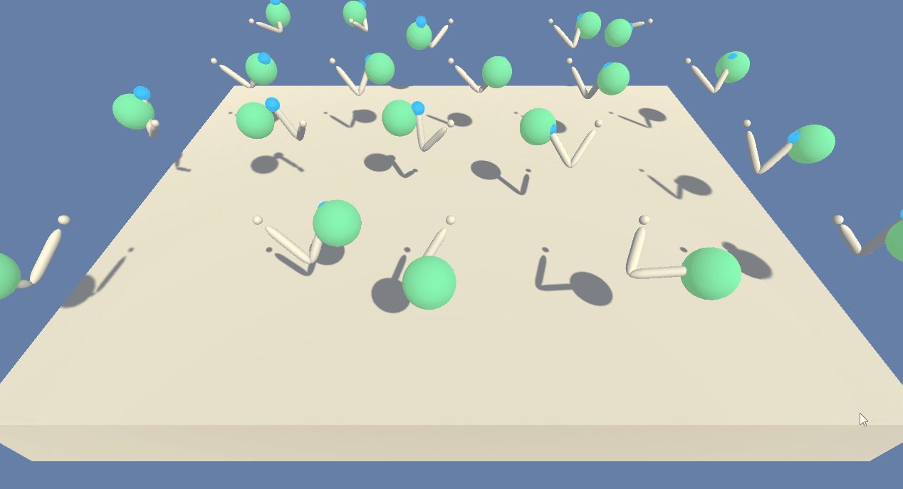

# udacity-drl-continuous-control
Udacity Deep Reinforecement Learning Nanodegree project repo

# Project details
The task in this project was to train an agent to solve an environment where 20 double-jointed arms need to be controlled to stay in moving target locations. The task is episodic and considered solved when the average score received 100 consecutive episodes and over the 20 agents (arms) exceeds +30. 

In the provided solution, the agent is trained for 400 episodes and it gains an average reward of 
+38.15 over 100 consecutive episodes at the end of training. The environment is considered first solved after 104 episodes.

## Trained agent in action

## Rewards
The agent receives a reward of `+0.1` for each time step it stays in the target location (per arm).

## State space
The continuous state space has 33 dimensions that contain the agent's rotation, velocity and angular velocity (one observation per each of the 20 arms).

## Actions
Each action is a vector with four numbers, that correspond to torque applicable to the two joints. Each entry in the vector is a float between -1 and 1.

# Getting started
This code was developed and tested on Python 3.6.4 and PyTorch 0.4.1. The included environment executable is for Windows. The links for Linux/Mac environments are provided below (provided by Udacity, might not work in the future):

[Linux](https://s3-us-west-1.amazonaws.com/udacity-drlnd/P2/Reacher/Reacher_Linux.zip)

[MacOS](https://s3-us-west-1.amazonaws.com/udacity-drlnd/P2/Reacher/Reacher.app.zip)

## Installing dependencies
A working Python installation is required. An easy way is to install using [Anaconda](https://www.anaconda.com/download/). To install a specific Python version using Anaconda, see [link](http://docs.anaconda.com/anaconda/faq/#how-do-i-get-the-latest-anaconda-with-python-3-5).

Additionally, PyTorch needs to be installed by first running (if you installed Python with Anaconda) 

`conda install pytorch -c pytorch` 

and then

`pip3 install torchvision` 

from the command line. See [PyTorch website](https://pytorch.org/) for more instructions and details.

Finally, Unity ML-Agents version 0.4.0b needs to be installed from [here](https://github.com/Unity-Technologies/ml-agents/releases/tag/0.4.0b). To install, download the .zip archive and unzip, navigate to the `python` directory, and run 

`pip3 install .`. 

For additional help see the [installation guide](https://github.com/Unity-Technologies/ml-agents/blob/master/docs/Installation.md) (Note! the link is for new version of the ML-Agents where some of the syntax has changed from the version used in this project).

# Instructions to run the code
First clone or download this repository. 

Easiest way to replicate the results is to launch a jupyter notebook (contained with Anaconda installation of Python) by running 

`jupyter notebook` 

from the command line in the project root. Then, open the [Report.ipynb](Report.ipynb) file from the jupyter webpage UI and follow the instructions there.

If you want to explore the code further, it is organized as follows under the `ddpg/` folder:

1. `agent.py` contains code for the agent.
2. `model.py` contains the neural network code that is used by the agent.
3. `ddpg_trainer.py` contains code that is used to train the agent.
4. Saved weights for the Actor and Critic networks can be found under the `models/` directory in the project root (to see how to load the trained model, refer to the [Report](Report.ipynb)). Checkpointed weights are provided every 100 iterations (`checkpoint_[num_iters]_[actor/critic].pth`) and when the environment was first solved (`[actor/critic]_solved.pth`).
